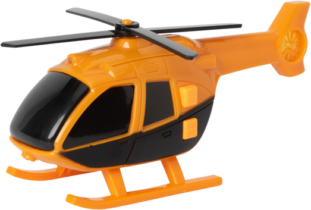

   
  
   
   

## 朝拾夕丢

本文用于记录平时工作学习中的总结记录。

> 灵感来自学了就忘的脑子

### 日常

* [每日 ugly](/docs/ugly.md)
### 学习总结

* [解剖 js 事件循环](https://github.com/ls365882248/blog/issues/2)
* [typescript 高级](https://github.com/ls365882248/blog/issues/9)
* [core react](https://github.com/ls365882248/blog/issues/10)

### 技术探索

* [如何实现 Skeleton](https://github.com/ls365882248/blog/issues/1)

### 猫走狗步

* [Oracle列转行函数LISTAGG](https://github.com/ls365882248/blog/issues/6)

